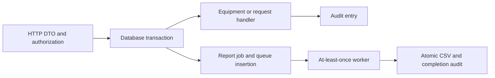

# Architecture

The modular monolith has one PostgreSQL database. Controllers accept explicit input objects; application handlers make decisions; Doctrine persists the result. The triage policy has no framework or database dependency.

| Module | Owns | Collaboration boundary |
|---|---|---|
| Access | Principals, opaque tokens, permissions | Principal and authorization services |
| Equipment | Immutable equipment register | Catalog lookup |
| ServiceRequests | Lifecycle, triage, assignment, resolution | Scoped queries and command handlers |
| Reporting | Criteria, queue message, immutable CSV | Request/report queries |
| Audit | Allowlisted transactional history | Application writer |
| Shared | Idempotency, persistence and HTTP infrastructure | Small named services, not a generic framework |

Flow summary: authenticated commands enter explicit handlers; domain changes and audit commit together. Report commands also enqueue on that same connection.

The worker transaction is later and separate from command acceptance. Labels and arrows convey meaning without color.

## Command transactions

A unique principal/key reservation blocks concurrent identical commands until the first transaction commits or rolls back. The fingerprint includes method, path, validated payload, and version precondition. Only successful responses are retained. Authentication, role, and visibility are checked before replay; recognized replay precedes rejection of its old ETag.

Requests use Doctrine's integer optimistic version. Both HTTP preconditions and the database condition are necessary. Two independently hydrated version-one records cannot both commit. Audit and reservation writes roll back with a losing command.

## Reports

Messenger's Doctrine transport uses the default DBAL connection, migration-created tables, `auto_setup=false`, and polling. Integration tests observe queue/job visibility from a second connection before rollback. No broker, relay, or second outbox table is necessary.

The worker locks the job and requesting account, verifies the current active coordinator role, then reads one ordered bounded SELECT snapshot. CSV, metadata, and completion audit commit together. Ready or terminally failed reports are no-ops on redelivery.

Three retries precede the failure transport and generic failed status. Invalid message types cannot instantiate arbitrary PHP objects. Database outages may prevent status updates as well as delivery; operators must inspect state after recovery. There is no exactly-once or distributed-atomicity claim.

See [concurrency](adr/0002-concurrency-and-idempotency.md) and [report delivery](adr/0003-transactional-report-delivery.md).
